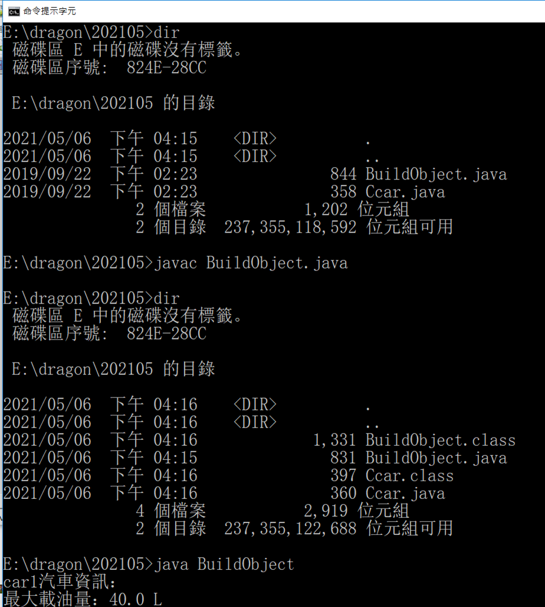

# 期末考必考題
```
舉程式碼範例說明物件導向程式設計三要件: 封裝  繼承   多形

 overloading vs override 
```

# 範例程式1

### Ccar.java
```
package ex06;

public class Ccar {
	public double gas, tbo;              //宣告最多載油量, 平均耗油量
	public double max_dist = 0;          //加滿油可行駛最長距離
	
	public void maxDist() {              //計算可行駛最長距離
	    max_dist = gas * tbo;
	}
	 
	public double dist(double oil) {     //一般加油可行駛距離
	    return oil * tbo;
	}
```
### BuildObject.java
```
ublic class BuildObject {
	public static void main(String[] args) {
	    Ccar car1;                         //宣告car1物件
		car1 = new Ccar();                 //建立car1物件
		car1.gas = 40;                     //設定car1物件的屬性值
		car1.tbo = 13.6;
		car1.maxDist();                    //呼叫car1物件的方法
		double distance = car1.dist(20);   //呼叫car1物件的方法,並取得傳回值
		System.out.println("car1汽車資訊：");
		System.out.println("最大載油量：" + car1.gas + " L");
		System.out.println("平均耗油量：" + car1.tbo + " km/L");
		System.out.println("加滿油可行駛 " + car1.max_dist + " km");
		System.out.println("加油20L可行駛 " + distance + " km");
			    
		Ccar car2 = new Ccar();            //宣告並建立car2物件
		car2.gas = 60;                     //設定car2物件的屬性值
		car2.tbo = 9.5;
	}
```



# 建構式(Constructor) 範例程式1
```
ackage constructor;

class Ccar {
   private double gas = 50;           //初始化gas(最多載油量)資料成員預設值
   private double tbo = 12;           //初始化tbo(平均耗油量)資料成員預設值
   private double max_dist;           //加滿油可行駛最長距離
   
   private void setGas(double g) {
     if(g>30 && g<80) gas = g;
   }
   
   private void setTbo(double t) {
     if(t>4 && t<20) tbo = t;
   }
   
   private void maxDist() {           //計算可行駛最長距離
     max_dist = gas * tbo;
   }
   
   public Ccar() {              //Ccar類別的構式,沒有傳入引數
     maxDist();
   }      
   
   public Ccar(double g) {      //Ccar類別的構式,傳入一個引數
     setGas(g);                 //呼叫setGas()方法,初始化gas資料成員
     maxDist();
   }
   
   public Ccar(double g, double t) {   //Ccar類別的構式,傳入二個引數
     setGas(g);                 //呼叫setGas()方法,初始化gas資料成員
     setTbo(t);                 //呼叫setGas()方法,初始化gas資料成員
     maxDist();
   }
   
   public double getDist() {      //傳出資料
     return max_dist;
   }
}

public class Constructor {                    //主類別
   public static void main(String[] args) {    //主程式
     Ccar car1 = new Ccar();                   //使用沒有引數的建構式
     System.out.println("new Ccar() 加滿油可行駛 " + car1.getDist() + " km");
     
     Ccar car2 = new Ccar(40.5);               //使用一個引數的建構式
     System.out.println("new Ccar(40.5) 加滿油可行駛 " + car2.getDist() + " km");
     
     Ccar car3 = new Ccar(64.5, 9.2);          //使用二個引數的建構式
     System.out.println("new Ccar(64.5,9.2) 加滿油可行駛 " + car3.getDist() + " km");
  }
```
# 6.5 靜態成員
```
package staticMember;

class Ccar {                        //汽車類別
    private static int car_num;      //宣告car_num為私有靜態資料成員   static
    private double gas = 50;       
    private double tbo = 12;       
   
    private void setGas(double g) {
       if(g>30 && g<80) gas = g;
    }
    private void setTbo(double t) {
       if(t>4 && t<20) tbo = t;
    }

    public Ccar() {              
       car_num++;
    }            
    public Ccar(double g) {      
       setGas(g);               
       car_num++;
    }
    public Ccar(double g, double t) {  
       setGas(g);               
       setTbo(t);              
       car_num++;
    }
   
    public static void getObjectNum() {      //公開靜態方法成員static 
       System.out.print("第 " + car_num + "部車,");
    }
   
    public void showValue() {                //公開一般方法成員
       System.out.println("最多載油量 " + gas + ",平均耗油量 " + tbo);
    }
}

public class StaticMember {                    //主類別
    public static void main(String[] args) {   //主程式
       Ccar car1 = new Ccar();                 
       Ccar.getObjectNum();     // 類別.靜態方法
       car1.showValue();
       
       Ccar car2 = new Ccar(40.5);                
       car2.getObjectNum();                  //建議改用Ccar.getObjectNum();
       car2.showValue();
       
       Ccar car3 = new Ccar(64.5,9.2);                 
       car1.getObjectNum();                  //建議改用Ccar.getObjectNum();
       car3.showValue();
    }
}
```
# 6.6 this參考自身類別
```
package thisDemo;

class Cperson {
    private int age;
    public void ShowAge(int age) {
       this.age = age;
       age = age + 2;
       System.out.println("傳入的 age 變成 " + age);
       System.out.println("this age = " + this.age);
    }
}

public class ThisDemo {
    public static void main(String[] args) {
       Cperson Joe = new Cperson();
       Joe.ShowAge(20);
    }
```
